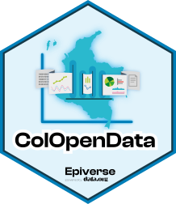
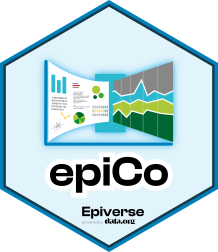
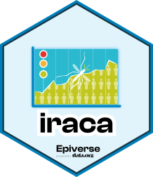
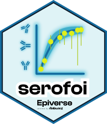

<!-- README.md is generated from README.Rmd. Please edit that file -->

This repository is inspired and re-uses infrastructure from the [RStudio
hex-stickers repo](https://github.com/rstudio/hex-stickers).

To create a logo for a new Epiverse-TRACE package, check out our
[one-page
cheatsheet](https://datadotorg.box.com/v/epiverse-hexstickers).

# Epiverse-TRACE hex stickers

<table>
<tr>
<td>
 <a href="PNG/cfr.png">cfr.png</a> <a href="SVG/cfr.svg">cfr.svg</a>
</td>
<td>
 <a href="PNG/cleanepi.png">cleanepi.png</a> <a href="SVG/cleanepi.svg">cleanepi.svg</a>
</td>
<td>
 <a href="PNG/ColOpenData.png">ColOpenData.png</a> <a href="SVG/ColOpenData.svg">ColOpenData.svg</a>
</td>
<td>
 <a href="PNG/epichains.png">epichains.png</a> <a href="SVG/epichains.svg">epichains.svg</a>
</td>
<td>
 <a href="PNG/epiCo.png">epiCo.png</a> <a href="SVG/epiCo.svg">epiCo.svg</a>
</td>
</tr>
<tr>
<td>
 <a href="PNG/epidemics.png">epidemics.png</a> <a href="SVG/epidemics.svg">epidemics.svg</a>
</td>
<td>
 <a href="PNG/epiparameter.png">epiparameter.png</a> <a href="SVG/epiparameter.svg">epiparameter.svg</a>
</td>
<td>
 <a href="PNG/epiparameterDB.png">epiparameterDB.png</a> <a href="SVG/epiparameterDB.svg">epiparameterDB.svg</a>
</td>
<td>
 <a href="PNG/episoap.png">episoap.png</a> <a href="SVG/episoap.svg">episoap.svg</a>
</td>
<td>
 <a href="PNG/epitkit.png">epitkit.png</a> <a href="SVG/epitkit.svg">epitkit.svg</a>
</td>
</tr>
<tr>
<td>
 <a href="PNG/finalsize.png">finalsize.png</a> <a href="SVG/finalsize.svg">finalsize.svg</a>
</td>
<td>
 <a href="PNG/iraca.png">iraca.png</a> <a href="SVG/iraca.svg">iraca.svg</a>
</td>
<td>
 <a href="PNG/linelist.png">linelist.png</a> <a href="SVG/linelist.svg">linelist.svg</a>
</td>
<td>
 <a href="PNG/numberize.png">numberize.png</a> <a href="SVG/numberize.svg">numberize.svg</a>
</td>
<td>
 <a href="PNG/readepi.png">readepi.png</a> <a href="SVG/readepi.svg">readepi.svg</a>
</td>
</tr>
<tr>
<td>
 <a href="PNG/scenarios.png">scenarios.png</a> <a href="SVG/scenarios.svg">scenarios.svg</a>
</td>
<td>
 <a href="PNG/serofoi.png">serofoi.png</a> <a href="SVG/serofoi.svg">serofoi.svg</a>
</td>
<td>
 <a href="PNG/simulist.png">simulist.png</a> <a href="SVG/simulist.svg">simulist.svg</a>
</td>
<td>
 <a href="PNG/sivirep.png">sivirep.png</a> <a href="SVG/sivirep.svg">sivirep.svg</a>
</td>
<td>
 <a href="PNG/superspreading.png">superspreading.png</a> <a href="SVG/superspreading.svg">superspreading.svg</a>
</td>
</tr>
<tr>
<td>
 <a href="PNG/vaccineff.png">vaccineff.png</a> <a href="SVG/vaccineff.svg">vaccineff.svg</a>
</td>
</tr>
</table>
